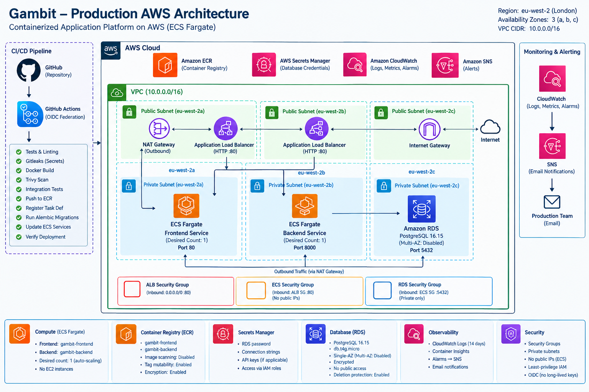

# Gambit Production Architecture

## Overview

Gambit is a production-style AWS platform deployed in **eu-west-2 (London)**. It consists of a React frontend, FastAPI backend, PostgreSQL database, ECS Fargate workloads, and AWS services for networking, secrets, observability, alerting, and CI/CD.

## AWS Region and Availability

- **Region:** `eu-west-2`
- **Application AZs:** `eu-west-2a`, `eu-west-2b`
- **RDS subnet group:** `eu-west-2a`, `eu-west-2b`, `eu-west-2c`
- **VPC:** `10.0.0.0/16`

The application layer spans two Availability Zones. The current RDS configuration is single-AZ with Multi-AZ disabled.

## High-Level Architecture

```text
Internet
   |
   v
Application Load Balancer
HTTP :80
   |
   +--------------------+
   |                    |
   v                    v
ECS Fargate          ECS Fargate
Frontend             Backend
Nginx :80            FastAPI :8000
                          |
                          v
                    RDS PostgreSQL
```

Editable Mermaid source: [`architecture.mmd`](architecture.mmd)

Rendered portfolio diagram:



## Network Architecture

The VPC uses public subnets for the ALB and private application subnets for ECS. RDS is private and uses an RDS subnet group spanning three Availability Zones.

### Traffic Flow

```text
Internet
   |
   v
Public ALB :80
   |
   +----> Frontend Target Group :80
   |
   +----> Backend Target Group :8000
                  |
                  v
             RDS PostgreSQL :5432
```

ECS tasks do not receive public IP addresses. The ALB is the public application entry point.

## Application Components

### Frontend

- React application
- Production bundle served by Nginx
- ECS Fargate
- Container port `80`
- Desired count `1`
- Private application subnets

### Backend

- FastAPI application
- ECS Fargate
- Container port `8000`
- Desired count `1`
- Health endpoint `/health`
- Private application subnets

### Database

- Amazon RDS PostgreSQL `16.15`
- Instance class `db.t4g.micro`
- Database `platform`
- Port `5432`
- Public accessibility disabled
- Encryption enabled
- Deletion protection enabled
- Multi-AZ disabled
- Automated backup retention `1 day`

## Security Boundaries

```text
Internet
   |
   v
ALB Security Group
   |
   v
ECS Security Group
   |
   v
RDS Security Group
```

Production database credentials are supplied through AWS Secrets Manager. RDS is not publicly accessible.

## Compute Architecture

### ECS Cluster

- Cluster: `gambit-production`
- Launch type: Fargate
- Container Insights: enabled

### Backend Task

- Family: `gambit-production-backend`
- CPU: `256`
- Memory: `512 MiB`
- Port: `8000`
- Fargate platform: `1.4.0`
- Log group: `/ecs/gambit-production`

### Frontend Task

- Family: `gambit-production-frontend`
- CPU: `256`
- Memory: `512 MiB`
- Port: `80`
- Log group: `/ecs/gambit-production`

Both services currently run with desired count `1`. No production autoscaling policy is documented as active.

## Container Registry

Amazon ECR stores:

- `gambit-frontend`
- `gambit-backend`

GitHub Actions publishes images using the Git commit SHA as the image tag.

CI performs Trivy image scanning. The current image policy blocks fixed `CRITICAL` vulnerabilities while ignoring unfixed vulnerabilities.

ECR scan-on-push is currently disabled and tag mutability remains enabled.

## Database Migrations

Alembic manages database schema changes.

Production deployment order:

```text
Build and test
      |
      v
Push image to ECR
      |
      v
Register backend task definition
      |
      v
Run Fargate migration task
      |
      v
alembic upgrade head
      |
      v
Update ECS services
      |
      v
Wait for service stability
```

A deployment rollback restores application revisions but does not automatically reverse database migrations. Database recovery is handled separately through the DR and incident-response procedures.

## Secrets Management

Production database credentials are stored in AWS Secrets Manager. The ECS task execution role can retrieve the required database secret.

Credentials are not stored directly in application source code or committed to Git.

## Observability

Amazon CloudWatch provides:

- ECS application logs
- Container Insights
- ECS service monitoring
- ALB-related monitoring
- RDS monitoring
- CloudWatch alarms

Primary log group:

```text
/ecs/gambit-production
```

Log retention is `14 days`.

Configured alarms include ECS CPU and memory utilization, no running ECS tasks, ALB HTTP 5xx errors, and unhealthy targets.

SNS topic:

```text
gambit-production-alerts
```

The configured email subscription is confirmed.

## CI/CD Architecture

GitHub Actions provides the production deployment pipeline using GitHub OIDC federation rather than long-lived AWS access keys.

The production deployment path is triggered by pushes to `develop`.

Pipeline stages include:

1. Frontend lint and build
2. Backend tests
3. Dependency auditing
4. Secret detection
5. Docker builds
6. Trivy image scanning
7. Docker Compose integration testing
8. AWS OIDC authentication
9. ECR image push
10. ECS task-definition registration
11. Alembic migration
12. ECS service update
13. Deployment stability verification

Pull requests and pushes to `main` run CI validation, but the production ECR/ECS deployment path is tied to `develop`.

## Infrastructure as Code

Terraform manages the AWS infrastructure baseline, including:

- VPC and networking
- Security groups
- Application Load Balancer
- ECS cluster and service baseline
- ECR repositories
- RDS
- Secrets-related infrastructure
- CloudWatch resources
- SNS alerting
- IAM resources

Terraform state is stored remotely using an S3 backend with locking support.

## Terraform and Application Deployment Boundary

Terraform manages the infrastructure baseline. GitHub Actions manages application image publication, task-definition revisions, production ECS deployments, and database migration execution.

The ECS services use Terraform lifecycle behavior so Terraform does not continuously replace application task-definition revisions managed by CI/CD.

## Backup and Disaster Recovery

RDS automated backups and point-in-time recovery are enabled.

Current configuration:

- Automated backup retention: `1 day`
- Backup window: approximately `03:00–04:00 UTC`
- Point-in-time recovery: verified
- Manual RDS snapshot: available
- Deletion protection: enabled
- Storage encryption: enabled

Current DR limitations:

- RDS Multi-AZ disabled
- One-day backup retention
- No production restore drill completed
- No multi-region recovery architecture
- No formal measured RTO/RPO

See [`dr-runbook.md`](dr-runbook.md).

## Architectural Limitations

- ALB currently uses HTTP on port `80`; HTTPS/TLS is not implemented.
- ECS frontend and backend desired counts are currently `1`.
- RDS Multi-AZ is disabled.
- RDS backup retention is `1 day`.
- No multi-region disaster recovery architecture exists.
- No formal RTO/RPO has been measured.
- No production restore drill has been performed.
- ECR scan-on-push is disabled.
- ECR tag mutability remains enabled.
- Some IAM policies retain broader resource scopes where required by the current implementation.

## Design Principles

1. Infrastructure as Code through Terraform.
2. Least-privilege access where practical.
3. Private ECS workloads and private RDS.
4. OIDC-based CI/CD authentication.
5. Git SHA image tagging.
6. Controlled automated database migrations.
7. Centralized logs, metrics, and alarms.
8. Documented backup, recovery, and incident procedures.

## Related Documentation

- [`architecture.mmd`](architecture.mmd) — editable Mermaid architecture source
- [`architecture.png`](architecture.png) — rendered architecture diagram
- [`security-policy.md`](security-policy.md)
- [`ci-cd-runbook.md`](ci-cd-runbook.md)
- [`deployment-runbook.md`](deployment-runbook.md)
- [`dr-runbook.md`](dr-runbook.md)
- [`incident-response.md`](incident-response.md)

---

**Architecture Version:** 1.1  
**Environment:** Production  
**AWS Region:** `eu-west-2`  
**Last Updated:** September 2026
